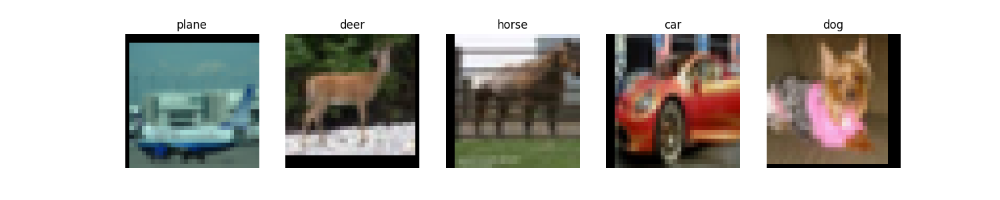
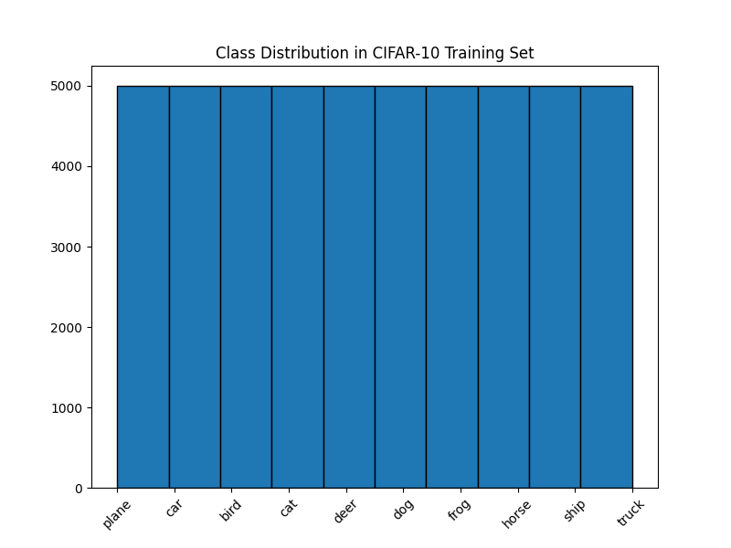
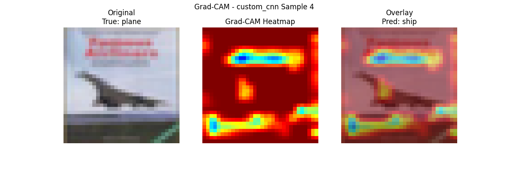

# CIFAR-10 Image Classification
A deep learning project for classifying CIFAR-10 images using PyTorch on an NVIDIA RTX 4060 GPU. Features a custom CNN (70–80% accuracy) and fine-tuned ResNet-18 (85–90% accuracy), with exploratory data analysis (EDA), model evaluation, Grad-CAM for interpretability, and a Streamlit web app for interactive predictions.
Features

Data Preprocessing: Loads CIFAR-10 dataset with PyTorch DataLoaders.
EDA: Visualizes sample images and class distribution (figures/sample\_images.png, figures/class\_distribution.png).
Models: Custom CNN and ResNet-18, trained with mixed precision.
Training: trains the models with 20 epochs
Evaluation: Confusion matrices and sample predictions (figures/confusion\_matrix\_*.png, figures/sample\_predictions\_*.png).
Grad-CAM: Visualizes model attention with heatmaps (figures/gradcam\_\*.png).
Streamlit App: Interactive web interface for image classification (app.py).

___

## 🗂️Repository Structure
```
cifar10-image-classiffication/
├── notebooks/               # Jupyter notebooks
│   └── cifar10\_eda.ipynb    # EDA visualizations
├── src/                     # Python scripts
│   ├── preprocess.py        # Data loading
│   ├── model.py             # Model definitions
│   ├── train.py             # Training
│   ├── evaluate.py          # Model evaluation
│   ├── gradcam.py           # Grad-CAM visualizations
├── models/                  # Trained model weights
│   ├── custom\_cnn.pth       # Custom CNN weights
│   ├── custom\_cnn\_best.pth  # Best custom CNN weights
│   ├── resnet18.pth         # ResNet-18 weights
│   ├── resnet18\_best.pth    # Best ResNet-18 weights
├── figures/                 # Visualizations
│   ├── sample\_images.png    # Sample CIFAR-10 images
│   ├── class\_distribution.png  # Class distribution histogram
│   ├── gradcam\_\*.png        # Grad-CAM heatmaps
├── app.py                   # Streamlit app
├── requirements.txt         # Dependencies
├── README.md                # Project documentation

___
```
## ⚙️ Installation
```bash
Clone the Repository:
git clone https://github.com/Mariza-Sitcheu/cifar10-image-classification.git
cd cifar10-image-classification

Create Virtual Environment (Python 3.11 recommended):
python -m venv .venv 
.venv\\Scripts\\activate  # Windows
source .venv/bin/activate  # Linux/Mac

Install Dependencies:
pip install -r requirements.txt

Key dependencies:

torch==2.5.1+cu121
torchvision==0.20.1+cu121
streamlit==1.36.0
matplotlib==3.8.4
opencv-python==4.10.0.84
tqdm==4.66.5
```
## 🚀Usage
```bash
Exploratory Data Analysis:
jupyter notebook notebooks/cifar10\_eda.ipynb

Generates figures/sample\_images.png and figures/class\_distribution.png.

Train Models:
python src/train.py

Trains custom CNN and ResNet-18, saves weights to models/ Runtime: ~10–20 minutes per model on RTX 4060.

Evaluate Models:
python src/evaluate.py

Generates figures/confusion\_matrix\_*.png, figures/sample\_predictions\_*.png.

Grad-CAM Visualizations:
python src/gradcam.py

Produces figures/gradcam\_\*.png showing model attention heatmaps.

Run Streamlit App:
streamlit run app.py

Opens a web interface at http://localhost:8501 for image classification.
```


## 📈Results
```
Custom CNN: ~70–80% test accuracy.
ResNet-18: ~85–90% test accuracy.
Visualizations:
```







## 🧪 Requirements
```
Python (3.12 recommended)
NVIDIA GPU with CUDA 12.1 (e.g., RTX 4060)
PyTorch 2.5.1 with CUDA support
Streamlit for web app
```
