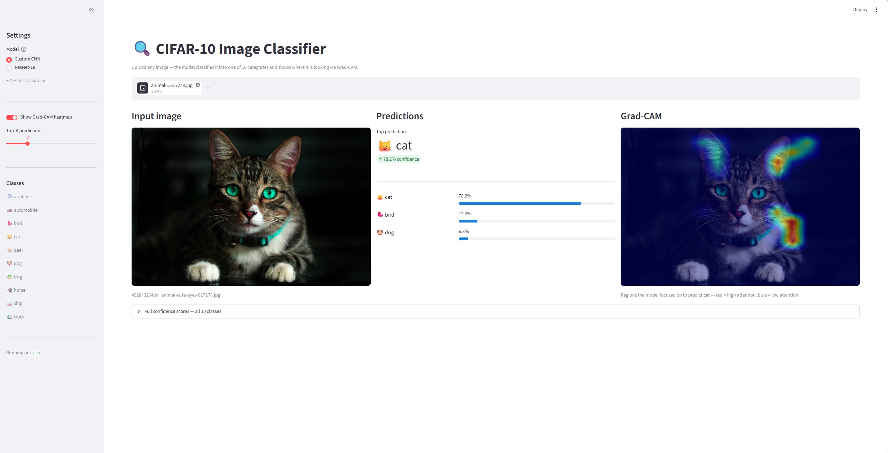
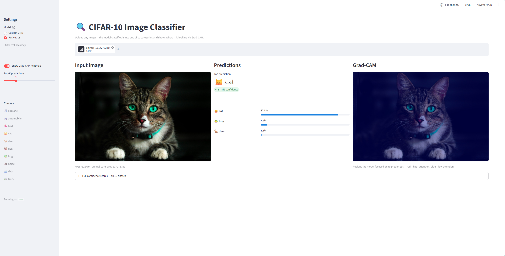
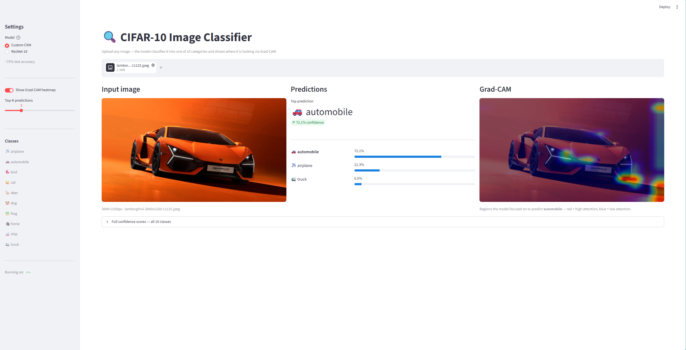
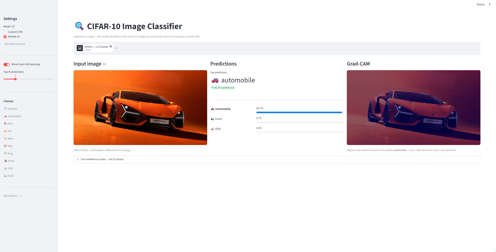
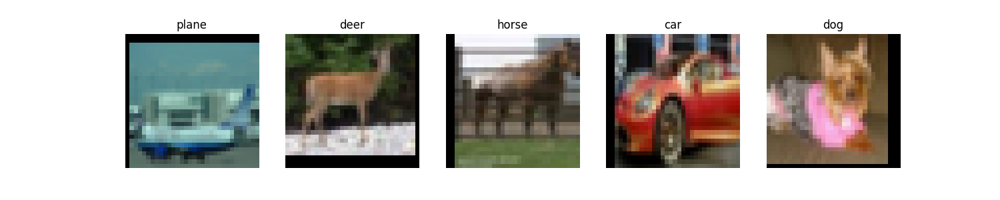
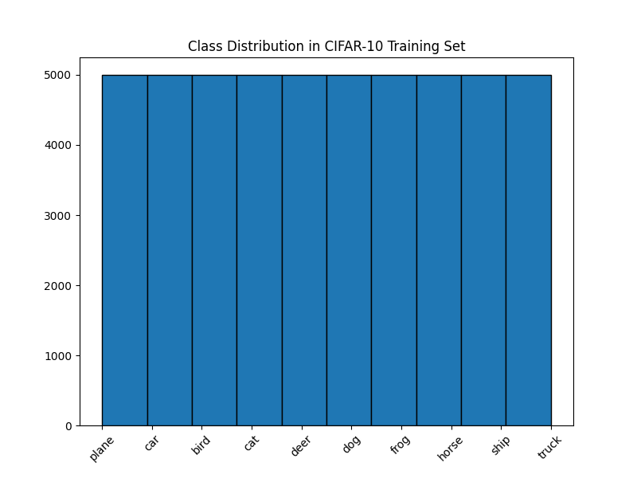
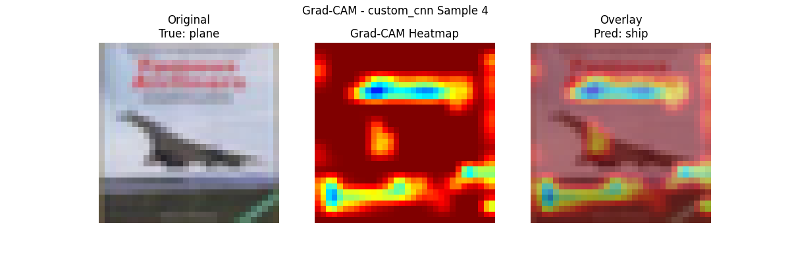

# 🔍 CIFAR-10 Image Classifier

> Deep learning image classifier with Grad-CAM interpretability — built with PyTorch and Streamlit.

[](https://github.com/Mariza-Sitcheu/cifar10-image-classification/actions)
[](https://cifar10-image-classification-app.streamlit.app/)

---

## 🚀 [Try the live app](https://cifar10-image-classification-app.streamlit.app/)

## What it does

Upload any image — the app classifies it into one of 10 CIFAR-10 categories and shows **where the model is looking** via Grad-CAM heatmaps.

| Feature | Detail |
|---------|--------|
| Models | Custom CNN (~76% accuracy) and fine-tuned ResNet-18 (~85% accuracy) |
| Interpretability | Grad-CAM overlays on the uploaded image |
| Confidence | Top-K predictions with probability bars |
| Model selector | Switch between CNN and ResNet-18 in the sidebar |
| Tests | 9 unit tests covering models and Grad-CAM |
| Docker | Containerised for portable deployment |

---

## Results

| Model | Test accuracy |
|-------|--------------|
| Custom CNN | ~76% |
| ResNet-18 (fine-tuned) | ~85% |

**App screenshots:**






**Data visualisations:**





---

## Repository structure

```
cifar10-image-classification/
├── src/
│   ├── model.py          # CustomCNN and ResNet-18 definitions
│   ├── preprocess.py     # CIFAR-10 data loading
│   ├── train.py          # Training loop with mixed precision
│   ├── evaluate.py       # Confusion matrix and metrics
│   ├── gradcam.py        # Reusable GradCAM class
│   └── models/           # Saved model weights (not tracked by git)
├── notebooks/
│   └── cifar10_eda.ipynb # Exploratory data analysis
├── tests/
│   └── test_model.py     # Unit tests (pytest)
├── figures/              # Saved visualisations
├── app.py                # Streamlit application
├── Dockerfile            # Container definition
├── requirements.txt      # Python dependencies
└── .github/workflows/
    └── ci.yml            # GitHub Actions CI pipeline
```

---

## Quickstart

**Prerequisites:** Python 3.11+

```bash
# 1. Clone
git clone https://github.com/Mariza-Sitcheu/cifar10-image-classification
cd cifar10-image-classification

# 2. Create and activate virtual environment
python -m venv .venv
.venv\Scripts\activate        # Windows
source .venv/bin/activate     # Linux/Mac

# 3. Install dependencies (CPU)
pip install -r requirements.txt

# For GPU (CUDA 12.1):
# pip install torch torchvision --index-url https://download.pytorch.org/whl/cu121

# 4. Train models (~10–20 min each)
python -m src.train

# 5. Run the app
streamlit run app.py
```

**With Docker:**
```bash
docker build -t cifar10-classifier .
docker run -p 8501:8501 -v $(pwd)/src/models:/app/src/models cifar10-classifier
```

**Run tests:**
```bash
pytest tests/ -v
```

---

## Training details

- **Custom CNN** — 2 conv blocks with batch norm and dropout, trained from scratch
- **ResNet-18** — pretrained on ImageNet, fine-tuned on CIFAR-10
- Both trained for 20 epochs with Adam optimiser
- Mixed precision training (`torch.amp`)

---

## Tech stack

PyTorch · torchvision · Streamlit · Grad-CAM · OpenCV · scikit-learn · Docker · GitHub Actions

---

## Author

**Mariza Sitcheu** · [GitHub](https://github.com/Mariza-Sitcheu)
